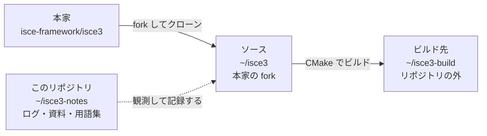

# isce3-notes

[ISCE3](https://github.com/isce-framework/isce3) を触るにあたっての作業ログと調査メモ。

ISCE3 は NASA JPL の InSAR / SAR 処理ライブラリ（C++ / CUDA コア + Python バインディング）。
初めて扱う技術スタックなので、手順・詰まった点・判明した仕様をここに残していく。

## このリポジトリについて

- **ISCE3 の fork ではない。** 本体のソースは一切含まない。純粋にメモ。
- クローン本体は別の場所（`~/isce3`）に置き、このリポジトリとは混ぜない。
  fork のコードツリーにメモを置くと upstream との差分に混ざり、PR を出すときに邪魔になるため。
- fork の wiki ではなく独立したリポジトリにしてある。fork は消すことがあり、
  消すと wiki も一緒に消えるため。

## 構成

```
CLAUDE.md    Claude Code 用のガイド。~/isce3 ではなくここに置いている
isce3.code-workspace  VS Code 用。~/isce3-notes と ~/isce3 を1つのワークスペースにまとめる
STATUS.md    現在地・次の一手・未解決事項。セッション終了時に必ず更新する
decisions.md 設計判断の記録。何をなぜ選び、何を却下したか
mermaid-guide.md  図を作るときの手順と原則。図を足したらこのファイルの一覧も更新する

logs/        日付ごとの作業ログ。後から書き換えない（そのときの記録として残す）
reference/   現時点の事実をまとめた資料。状況が変わったら上書き更新する
glossary/    技術・用語の解説。「そもそもそれは何か」を置く
```

### 3 つのパスの関係



`~/isce3` には**このリポジトリのファイルもビルド生成物も置かない**。
記録はここ（`~/isce3-notes`）に、ビルドは `~/isce3-build` に分けてある。
PR を出すまでの流れは [glossary/04-git.md](glossary/04-git.md) の図を参照。

### Claude Code の起動方法

| 使う版 | 方法 |
|---|---|
| ターミナル | `cd ~/isce3-notes && claude --add-dir ~/isce3` |
| VS Code 拡張 | `isce3.code-workspace` を開く |

`CLAUDE.md` は**起点から親方向へしか探索されない**。
`~/isce3` を起点にすると `~/isce3-notes` は兄弟ディレクトリなので見つからない。
だから**このリポジトリを起点にする**。**`~/isce3` には何も置かない。**

`/clear` では何もし直さなくてよい（作業ディレクトリも追加ディレクトリも維持される）。
ただし会話の記憶は消えるので、**`/clear` の前に `STATUS.md` を更新する**。

仕組みの詳細は [glossary/07-claude-code.md](glossary/07-claude-code.md)。

各ディレクトリの索引は、それぞれの README を参照。

- [logs/README.md](logs/README.md) — 作業ログの一覧
- [reference/README.md](reference/README.md) — 資料の一覧
- [glossary/README.md](glossary/README.md) — 用語集の一覧

## 運用ルール

- `logs/` は `YYYY-MM-DD-<短い題名>.md`。**追記のみ、過去のログは修正しない。**
  「そのとき何が起きたか」を残すのが目的なので、後から正しくしない。
- 内容が古くなった事実は `reference/` 側を直す。
- 新しい用語に出会ったら `glossary/` の該当ファイルに追記する。
- パスは `~/...` で書く。ユーザ名を含む絶対パスは書かない。
- 図を追加・更新するときは [mermaid-guide.md](mermaid-guide.md) に従う。**PNG はコミットせず** ` ```mermaid ` フェンスで埋め込む。

## 現在の状態

- ISCE3 `0.26.0-dev` を **CPU ビルド**でインストール済み（CMake 直叩き / `~/isce3-build`）
- `ctest` の基準値は **235/237**（608 秒）
- 落ちる 2 件は既知: `GeoToRdr`（最適化起因、未解決）、`stage_dem`（upstream バグ、対処不要）
  → **3 件以上落ちたら自分の変更を疑う**
- GPU (CUDA) ビルドは未対応

再現手順は [reference/environment.md](reference/environment.md)、
残課題は各ログの末尾を参照。

## 参考リンク

- upstream: https://github.com/isce-framework/isce3
- 公式ドキュメント: https://isce-framework.github.io/isce3/
- ビルド手順（公式）: https://isce-framework.github.io/isce3/buildinstall/
