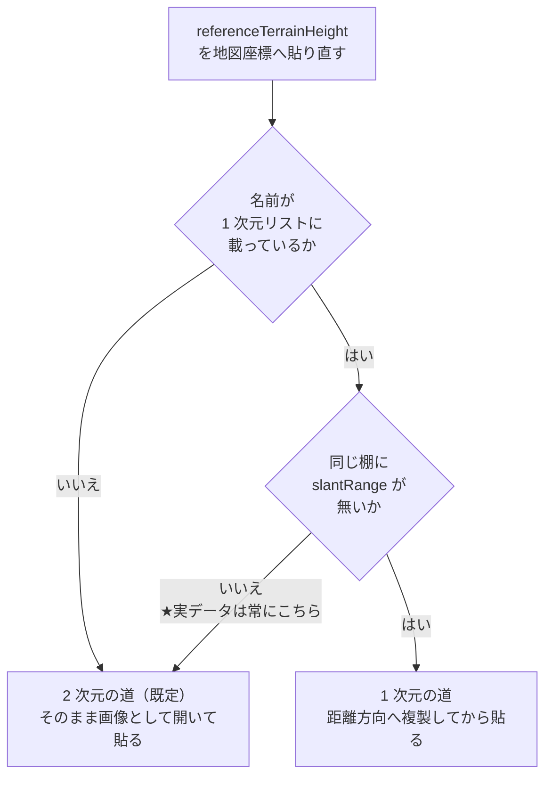

# 説明用メモ — `referenceTerrainHeight` が全 NaN になる

初版 2026-08-31 / **全面改訂 2026-09-16**（仕様・経緯・修正案・テストの順序を反映）。
根拠は `165-comment-証拠.md`、**再現手順は `再現手順-referenceTerrainHeight.md`**、
提出文は `165-comment.md`。

---

## 0. 結論を 6 行で

**この順に読むと繋がる。**調べた順序とは逆なので注意。

| | |
|---|---|
| ① | **仕様は「1 次元 → 2 次元」を求めている** |
| ② | **実データは仕様どおり 1 次元**（そうとしか書けない） |
| ③ | **なのに出力が全 NaN** |
| ④ | **判定が常に「2 次元」と答えるから** |
| ⑤ | **テストは科学データしか見ないので気づけない** |
| ⑥ | **直し方は分かっている。今も将来も同じ答えになる** |

以下、①〜⑥ の順に説明する。

---

## 前提（用語 4 つだけ）

| 用語 | やさしく言うと |
|---|---|
| **RSLC** | 衛星のレーダが撮ったままの画像。まだ地図に貼れていない |
| **GCOV / GSLC** | それを地図の座標に貼り直した製品。ISCE3 の出力 |
| **LUT** | 補正に使う数表。「この時刻ではこの値」という対応表 |
| **参照地形高**<br>`referenceTerrainHeight` | ジオコーディングが使った**基準の標高**の記録 |

レーダ画像を地図に貼るには「地面がどの高さにあるか」の仮定が要る。
斜め距離だけでは、高い山の手前か低い谷の奥か区別できないため。
**その仮定に使った標高を、後から検証できるよう製品に残したもの**が参照地形高。

---

## ① 仕様は「1 次元 → 2 次元」を求めている

同じ名前のデータセットが、**製品の中に 2 か所ある**。仕様（`XML/L2/nisar_L2_GCOV.xml`）が
`shape` で書き分けている。

| 場所 | 座標系 | 仕様の shape | 次元 |
|---|---|---|---|
| `sourceData/...`（RSLC の写し） | レーダ座標 | `sourceDataDopplerCentroidTimeLength` | **1 次元** |
| `processingInformation/parameters/...`（ジオコード済み） | 地図座標 | `dopplerCentroidShape` | **2 次元** |

仕様の説明文も **"as a function of map coordinates"**（地図座標の関数）と書いている。

> **この 2 つを繋ぐこと（レーダ座標 → 地図座標）が、この処理の仕様上の役割。**
> 「1 次元は対象外」ではなく、**1 次元は入力として正しい形**。

⚠️ **「2 次元化」という言葉は 2 つの意味で使われるので注意。**

1. **地図座標へ貼る**（＝今の処理。出力が 2 次元になる）
2. **格納形式を高度化する**（＝レーダ座標のまま時刻 × 距離にする。**将来の計画**）

---

## ② 実データは仕様どおり 1 次元

**「データの取り方が悪いのでは」は否定できる。**

* **ISCE3 に 2 次元で書く経路が存在しない。** 生成箇所は `writers/SLC.py` の 1 か所だけで、
  形状はアジマス長に固定（`np.zeros(n)`）。条件分岐もオプションも無い
* 手元の全プロダクトで実測: RSLC 2 本 + 同梱 `envisat.h5` すべて **`ndim=1`**
* GCOV の `sourceData` 側も `ndim=1` で、**値はちゃんと入っている**（79/79・31/31）

→ **どう取得しても 1 次元。2 次元の実データはまだ 1 つも存在しない。**

---

## ③ なのに出力が全 NaN

| 対象 | 有効画素 |
|---|---|
| 同梱データで作った GCOV | **0 / 410** |
| 公式プロダクト `028_168` | **0 / 156,420** |
| 公式プロダクト `028_152` | **0 / 111,531** |

**公式の配布物にも入っている**（`softwareVersion = 0.25.16`）。
しかも**同じ地図格子に載る他の層は埋まっている**（公式 `028_152` では 10 層が 10〜74%）。
仕様上こちらと同じ形の `dopplerCentroid` が 23〜30% 埋まっているのに、**この層だけが 0%**。

処理は**終了コード 0 で完了**し、GDAL のエラーが数行出るだけなので気づきにくい。

---

## ④ 判定が常に「2 次元」と答えるから

判定は **2 つの部分**でできている。

```python
flag_luts_are_1d_az = (all([var in LUT_1D_AZ_DATASETS ...])   # ← 1 次元の判定（名前で）
                       and slant_range_path not in ...)        # ← 後から足された門
```

**前半だけなら正しく動く。** 兄弟のレンジ方向（crosstalk）はこの形のままで、実際に動いている。

問題は後半。**「同じ棚に距離の目盛りがあるか」でデータの次元を判定している。**
ところがその目盛りは、同居する別の 2 次元データ（`effectiveVelocity`）のもので、
**RSLC を書くプログラム自身が無条件に置いている。**

→ **ISCE3 が作った RSLC では、この判定が「1 次元」と答えることは原理的にあり得ない。**

結果、1 次元のデータ（GDAL からは `80 × 1` に見える）を
2 次元の画像（`240 × 80`）として読もうとして失敗する。エラー文がそのまま言っている。

```
Requested (0,0) of size 105x31 on raster of 31x1
（105×31 をくれと言われた。実物は 31×1 しかない）
```

### 構造: 道は 2 本。1 次元の道には門がある

**⚠️「安全弁」という言い方は分かりにくいので、ここで構造を明示する。**
止めているのは **1 次元の道への入口**（2 次元の道ではない）。



**押さえるべき点は 3 つ。**

1. **2 次元の道が既定。** 1 次元の道は「条件を満たしたときだけ入れる例外路」。
   だから門が閉じていれば、何もしなくても全員 2 次元の道へ流れる
2. **門は 1 次元の道の入口にある。** 通行条件は
   「同じ棚に `slantRange` が**無い**こと」
3. **実データには必ず `slantRange` がある** → **門は常に閉じている**
   → 1 次元のデータも 2 次元の道へ送られ、そこで失敗する

| | 門番が止めたかったもの | 実際に止まっているもの |
|---|---|---|
| | **将来 2 次元になったデータ**（複製されては困る） | **全部**（今の 1 次元データを含む） |

**門の判定材料が「データ自身の次元」ではなく「隣に何が置いてあるか」だったのが誤り。**
修正案 B は、この門を**正しい材料で判定させ**（データ自身の次元）、
**距離軸の選択は別の判断に分ける**もの。だから門が守ろうとした将来の 2 次元も壊さない。

### なぜ「複製」するのか、2 次元だと何が困るのか

ジオコーディングは**面を貼る処理**なので、1 次元のベクトルは
**距離方向へ引き伸ばして面にする**（= その時刻の値をスワス全体に同じとみなす）。
1 本の値しか無い以上、これが唯一できる解釈。

⚠️ **2 次元に同じことをすると壊れる**（実測）。

| 入力 | 引き伸ばし後 | |
|---|---|---|
| `(80,)` | `(80, 240)` | ✅ 意図どおり |
| `(80, 240)` | **`(240, 19200, 1)`** | ❌ 3 次元。直後の `length, width = shape` で `ValueError` |

意味の面でも、**距離方向の変化を一定値で塗り潰す**ので 2 次元化の目的が消える。
→ **引き伸ばすかどうかは「データ自身の次元」で決めるしかない。**

詳しくは wiki の
[参照地形高](https://github.com/rindguitar/isce3-notes/wiki/Reference-Terrain-Height)。

### なぜその条件を書いたのか（相手の意図）

コミットの箇条書きが順番に語っている。

```
* add geocoding of 1-D LUTs ...                              ← まず 1 次元対応
* handle case in which `referenceTerrainHeight` is a 2-D LUT  ← ここで門を追加
```

名前だけで判定すると、**将来 2 次元化したときに誤って複製してしまう。**
それを防ぐ実行時チェックとして「距離軸の有無」を選んだ、と読むのが自然。

> **将来の 2 次元化に備えて置いた門が、現在の 1 次元の経路まで閉ざしてしまった。**

---

## ⑤ テストは科学データしか見ないので気づけない

**なぜエラーが出るのにテストが通るのか。**実測で確定した（区間に印を入れて実行）。

| 段 | やること | エラー |
|---|---|---|
| ① `gcov.run()` | **科学データ**を作る | 出ない |
| ② `populate_metadata()` | **メタデータ**を地図座標へ貼り直す | 🔴 **ここだけ** |
| ③ `h5py` で読む | **`HHHH` だけ**取り出す | — |
| ④ `assert_allclose` | **唯一の assert。** ノイズ電力を比較 | — |

**理由が 3 つ重なっている。**

1. **エラーが例外ではない。** GDAL が stderr に出すだけで処理は続く
2. **assert がメタデータを見ていない。** ②で壊れた層は③でも④でも読まれない
3. **テストコードに `referenceTerrainHeight` の出現が 0 回。** 検査するテストが無い
   （`.h5` フィクスチャには 11 件含まれている。**データはあるのに検査が無い**）

**エラーが 4 回出る内訳もこれで説明がつく。**
`geocode_modes`（`interp` / `area`）× `apply_noise_correction`（`False` / `True`）
＝ **② が 2 × 2 = 4 回**呼ばれる。

対照的に、**同じ変更で入ったレンジ方向の 1 次元経路にはテストがあり、そちらは動いている。**

> **テストがある方は動き、テストが無い方は壊れていた。**

---

## ⑥ 直し方（今も将来も同じ答えになる）

**元のコードは 2 つの判断を 1 つの条件で兼ねていた。そこが誤りの本体。**

| 判断すること | 正しくは何で決まるか |
|---|---|
| 値を距離方向へ複製する必要があるか | **データセット自身の次元** |
| 距離軸として何を使うか | **`slantRange` があるかどうか** |

この 2 つを分けたものが**候補 B**。実測結果は次のとおり。

| | 未修正 | 候補 A（次元だけ判定） | **候補 B** |
|---|---|---|---|
| **1 次元（現在）** | 🔴 0/410 | 134/410 | ✅ **178/410** |
| **2 次元（将来）** | ✅ 178/410 | — | ✅ **178/410** |

* **B は「2 次元入力 + 未修正」と完全一致**（マスク一致・値の最大差 **0.0**）。
  つまり**将来 2 次元化したときの動きを変えない**
* **1 次元でも 2 次元でも同じ答え**になる。出力が保存形式に依存しなくなる
* 科学データは **GCOV / GSLC ともビット単位で不変**。他のメタデータ層も変化なし
* A が狭いのは、距離軸を RSLC のレーダグリッドから作り直すため（縁の帯が欠ける）

⚠️ **フル ctest は未実行。** PR を出す前に必要。

---

## なぜ長年見逃されてきたか（経緯）

**2 回、1 次元に対処しようとして 2 回とも外している。**

| 版 | 変更 | 結果 |
|---|---|---|
| v0.23.0（2024-08） | #1928 が `sourceData` へ複製 | — |
| **v0.24.2（2025-01）** | **#1929 がジオコーディングを追加** | 🔴 **ここから全 NaN** |
| v0.25.0（2025-05） | #2137 が 1 次元 LUT 対応を追加 | 🔴 **まだ全 NaN** |

1. **#1929 は 1 次元を想定していた。** ラスタ生成を `try/except` で囲み、
   コメントに「Dataset is a 1-D vector instead of a 2-D array」と書いている。
   ⚠️ **だが発火しない。** 1 次元でも「開く」操作は成功し、失敗するのは**その後の読み出し**
2. **#2137 は 1 次元対応とテストを追加している**
   （コミットに `add unit test to exercise the geocoding of 1D LUTs`）。
   ⚠️ **だがテストは crosstalk だけを覆い**、使われた `winnipeg.h5` には
   `referenceTerrainHeight` が存在しない

---

## 「意図的にそのままにしているのでは？」への答え

**「意図」と「優先度」を分ける。否定できたのは前者だけ。**

| 問い | 答え |
|---|---|
| 1 次元を扱わなくてよい、という**意図**か | ❌ **違う**（上記のとおり 2 回対処を試みている） |
| 壊れているが**優先度が低い**という判断か | ⚠️ **あり得る。否定できない** |

#165 で「値はどうせ全部ゼロ」と分かっているため、
「値が入るようになってから直せばいい」という判断はあり得る。
議論は JPL 内部リポジトリ（`#2137`）にあり**確かめる手段がない**。

→ だから **#165 でまず「意図した挙動か」を聞き**、本文末尾に
「既知なら閉じてくれて構わない」と書いてある。

---

## #165 との違い（聞かれたら答える）

| | #165 | 今回 |
|---|---|---|
| 場所 | `sourceData/` 以下 | `processingInformation/` 以下 |
| 症状 | 値が全部 **0** | 値が全部 **NaN** |
| 原因 | RSLC を書くとき中身を入れていない（TODO 扱い） | **次元判定の誤りでジオコーディングが失敗** |

**#165 が直ってもこちらは直らない。**正しい標高が入っても、貼り直す処理で落ちるため。

---

## メンターの宿題 3 点への回答

| # | 指示 | 回答 | どこに |
|---|---|---|---|
| 1 | 実データのフォーマット確認 | ✅ 全プロダクト `ndim=1`。仕様も 1 次元と定義。取り方の問題ではない | ② |
| 2 | エラーが出るのにテストが通る理由・テストの順序 | ✅ エラーは `populate_metadata()` の中だけ。唯一の assert は科学データのみ | ⑤ |
| 3 | 1 次元と 2 次元の関係性 | ✅ 仕様上「1 次元 → 2 次元」の変換が役割。2×2 で実測 | ①⑥ |

---

## 残っている判断

* **#165 へのコメントを投稿してよいか**（下書きは貼れる状態）
* 投稿後、**新規 issue を立てるか・PR も出すか**
* PR を出すなら **フル ctest の実行**が必要（ユーザーが実行）
