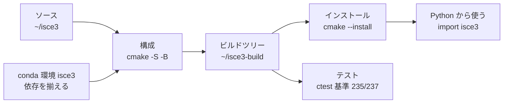

# 02. ビルドまわり — コンパイル / CMake / Ninja / pip

## 全体の流れ



`ctest` はビルドツリー（`~/isce3-build`）に対して走る。
**`pip install .` だとビルドツリーが残らないのでテストできない**（→ `decisions.md`）。

## そもそもビルドとは

**ソースコード（人間が読む文字列）を、実行できる形に変換する作業全体。**

```
[1] .cpp を 1 個ずつ機械語に翻訳            → コンパイル
[2] 翻訳結果を繋ぎ合わせて 1 個にまとめる    → リンク
[3] 完成物を所定の場所へ配置                → インストール
```

ISCE3 は `.cpp` が数百個あるので、[1] を数百回繰り返す。これがビルド時間の正体。

### コンパイル (compile)

`.cpp` 1 個を `.o`（オブジェクトファイル）1 個に翻訳する。
ファイル単位で独立しているので、**並列実行できる**。
`-j8` はこれを 8 個同時にやるという指定（CPU が 8 コアなので 8）。

### リンク (link)

バラバラの `.o` を繋いで、ライブラリや実行ファイルにする。
「A.cpp が呼んでいる関数 f の実体は B.o の中にある」という対応付けをする作業。

### 差分ビルド (incremental build)

**変更されたファイルだけを再コンパイルする**仕組み。
1 個直したら 1 個だけ翻訳し直せばよいので、2 回目以降は劇的に速い。

`pip install .` を捨てて CMake 直叩きに移行した最大の理由がこれ。
`pip install .` は毎回一時ディレクトリで作り直すので差分が効かない。

## ライブラリの種類

| 種類 | 拡張子 | 説明 |
|---|---|---|
| **静的ライブラリ** | `.a` | 実行ファイルの中に埋め込まれる |
| **共有ライブラリ** | `.so` | 実行時に別ファイルとして読み込まれる。Windows の `.dll` に相当 |
| **ヘッダオンリー** | `.h` のみ | コンパイル時に取り込まれるだけ。実体ファイルなし |

ISCE3 本体は `.so` として `~/isce3-build/install/lib/` に置かれる。
実行時にこれを見つけられないと動かないので、`LD_LIBRARY_PATH` の設定が必要になる
（→ [03-environment.md](03-environment.md)）。

## CMake

### 何をするものか

**ビルドの手順書を生成するツール。** CMake 自体はコンパイルしない。

```
CMakeLists.txt  →  [cmake]  →  build.ninja  →  [ninja]  →  実際のビルド
（設計図）                      （手順書）
```

なぜ 2 段階かというと、環境ごとに事情が違うため。
「Eigen はどこにある？」「コンパイラは何？」を調べてから手順書を作る必要がある。
この調査工程が **configure（構成）**。

### 今回使ったコマンド

```bash
cmake -S ~/isce3 -B ~/isce3-build -G Ninja \
  -DISCE3_FETCH_DEPS=OFF \
  -DWITH_CUDA=OFF \
  -DCMAKE_INSTALL_PREFIX=$HOME/isce3-build/install
```

| 部分 | 意味 |
|---|---|
| `-S ~/isce3` | **S**ource。ソースがどこにあるか |
| `-B ~/isce3-build` | **B**uild。作業場所をどこにするか |
| `-G Ninja` | **G**enerator。どの形式の手順書を作るか |
| `-D<名前>=<値>` | **D**efine。CMake 変数を設定する |

`-S` と `-B` を分けられるので、**ビルド場所をリポジトリの外に置けた**。
これで `~/isce3` を汚さずに済んだ。

### アウトオブソースビルド (out-of-source build)

**ソースとは別のディレクトリでビルドすること。** 逆はインソースビルド。

ISCE3 は `AssureOutOfSourceBuilds()` でインソースビルドを**明示的に拒否**する。
ソースディレクトリが中間生成物で埋まると、git で管理しづらくなるため。

### CMakeCache.txt

configure の結果を記録したファイル。ビルドディレクトリの中にある。
一度指定した `-D` の値はここに保存され、次回から省略できる。

逆に言うと、**一度設定した値は消さない限り残る**。
おかしくなったらビルドディレクトリごと消して作り直すのが早い。

### `find_package`

「Eigen はどこ？」を探す仕組み。今回のビルド失敗はここで起きた。

```
find_package(Eigen3 3.3.7)
```

「Eigen3 のバージョン 3.3.7 以上を探す」という意味だが、
互換性の判定方法はライブラリ側が決める。
Eigen は「**メジャーバージョンが一致すること**」を条件にしているため、
5.0.1 は 3.3.7 の要求を満たさないと判定された。

**数値の大小ではなくメジャーバージョンの一致**という点が重要。

### 主な CMake 変数

| 変数 | 意味 |
|---|---|
| `CMAKE_BUILD_TYPE` | `Debug` / `Release` / `RelWithDebInfo`。最適化の強さ |
| `CMAKE_INSTALL_PREFIX` | インストール先のルート |
| `CMAKE_CXX_FLAGS` | コンパイラに直接渡す追加オプション |

`RelWithDebInfo` は「最適化あり + デバッグ情報あり」。ISCE3 の既定値。

## Ninja / Make

CMake が生成した手順書を実行するツール。**ビルドを実際に走らせるのはこちら。**

| | 特徴 |
|---|---|
| **Make** | 古くからある定番 |
| **Ninja** | 速度重視。大規模プロジェクトでは体感差が出る |

ISCE3 のドキュメントは Ninja を推奨している。

```bash
cmake --build ~/isce3-build -j8   # CMake 経由で ninja を呼ぶ（推奨）
ninja -C ~/isce3-build            # 直接呼んでもよい
```

## ccache

**コンパイル結果をキャッシュするツール。**

同じソースを同じオプションでコンパイルしようとしたとき、
前回の結果を使い回して翻訳を丸ごと省略する。
ブランチを行き来する開発では効果が大きい。

ISCE3 の `CMakeLists.txt` は **PATH に ccache があれば自動で使う**。
configure のログに出ていた

```
-- Using ccache: /home/rindguitar/miniforge3/envs/isce3/bin/ccache
```

がその証拠。

注意: **オプションが変わると別物とみなされる。**
`-ffp-contract=off` を足した検証ビルドで ccache が効かなかったのはこのため。

## pip と Python のビルド

### pip

Python のパッケージインストーラ。`pip install .` は
「カレントディレクトリのパッケージをビルドしてインストールする」。

### wheel (`.whl`)

**ビルド済み Python パッケージの配布形式。**
`pip install` は内部で一度 wheel を作り、それを展開して配置する。
ログの `Building wheel for isce3` はこの工程。

### pyproject.toml

Python パッケージの設定ファイル。**ビルド方法をここで宣言する。**

ISCE3 のものは短い:

```toml
[build-system]
requires = ["scikit-build-core"]
build-backend = "scikit_build_core.build"
```

「ビルドには scikit-build-core を使う」という宣言。

**重要**: ISCE3 の `pyproject.toml` には `dependencies` の記述が**ない**。
つまり `pip install .` は numpy や gdal を入れてくれない。
先に conda で環境を作る必要があるのはこのため。

### scikit-build-core

**pip と CMake の橋渡しをする部品。**
`pip install .` と打つと、裏で CMake を呼んでビルドし、結果を wheel に詰める。

CMake 変数を渡したいときはこう書く:

```bash
pip install . -C cmake.define.WITH_CUDA=OFF
```

`-C` は設定を渡すオプションで、`cmake.define.<変数>` が
CMake の `-D<変数>` に対応する。

### editable インストール

`pip install -e .` の形式。ソースを直接参照するので、
編集しても再インストール不要になる（純 Python の場合）。

ただし ISCE3 は C++ のコンパイルが要るので、**editable でも C++ の変更には再ビルドが必要**。
結局 CMake 直叩きのほうが扱いやすい。

## 依存の取得方法

### `ISCE3_FETCH_DEPS`

ISCE3 が「依存ライブラリを自分でネットから取ってくるか」を決める設定。

| 状況 | 既定値 | 意味 |
|---|---|---|
| `pip install .` 経由 | `OFF` | conda に入っているものを使う |
| CMake 直叩き | **`ON`** | **ネットから取り直す** |

直叩きに移行したとき `-DISCE3_FETCH_DEPS=OFF` を明示したのは、
せっかく `eigen<4` に揃えた conda の Eigen を無視されないため。

### `cmake_dependent_option` の落とし穴

```cmake
cmake_dependent_option(ISCE3_FETCH_EIGEN "..." ON "ISCE3_FETCH_DEPS" OFF)
```

「`ISCE3_FETCH_DEPS` が真なら既定 ON、**偽なら強制的に OFF**」という意味。

つまり `ISCE3_FETCH_DEPS=OFF` の状態で `ISCE3_FETCH_EIGEN=ON` を指定しても**無視される**。
個別に有効化することはできない。
