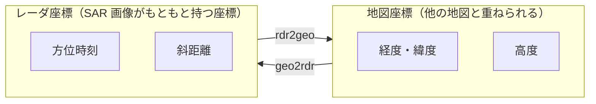

# 06. SAR / InSAR のドメイン用語

ISCE3 が何を計算しているのかの背景。

> ⚠️ この章は分野の一般知識に基づく。ISCE3 の実装を読んで確認したものではないので、
> 実際のコードと食い違う可能性がある。**確認したものには「確認済み」と書く。**

## SAR（合成開口レーダ）

**Synthetic Aperture Radar。** 人工衛星や航空機から電波を斜め下に照射し、
跳ね返りを捉えて地表の画像を作る技術。

光学カメラとの違い:

| | 光学 | SAR |
|---|---|---|
| 光源 | 太陽 | **自分で電波を出す** |
| 夜間 | 不可 | **可能** |
| 雲 | 透過しない | **透過する** |
| 得られる情報 | 色・明るさ | 反射強度と**位相** |

「夜でも雲があっても観測できる」ことが最大の強み。災害監視に向く。

### なぜ「合成開口」なのか

レーダの解像度はアンテナの大きさで決まる。細かく見たければ巨大なアンテナが要るが、
衛星に載せられる大きさには限界がある。

そこで、**衛星が飛びながら次々に観測し、それらをまとめて処理することで、
飛んだ距離ぶんの巨大なアンテナがあったかのように振る舞わせる**。
これが「開口（アンテナ）を合成する」の意味。

その代わり、**膨大な信号処理が必要**になる。ISCE3 が C++ と CUDA で
書かれている理由がここにある。

### 方向の呼び方

| 用語 | 意味 |
|---|---|
| **レンジ (range)** | 電波が飛ぶ方向。衛星から地表へ斜めに向かう向き |
| **アジマス (azimuth)** | 衛星が進む方向 |
| **スラントレンジ (slant range)** | 衛星から目標までの**直線距離** |
| **グラウンドレンジ (ground range)** | それを地表面に投影した距離 |
| **ルックサイド (look side)** | 進行方向に対して左右どちら側を見ているか |

SAR 画像はもともと「アジマス × スラントレンジ」の座標で作られる。
地図の座標ではないので、後で変換が要る（→ ジオコーディング）。

## 位相と干渉

### SLC (Single Look Complex)

**SAR の基本画像。1 画素が複素数**（実部と虚部）になっている。

複素数から 2 つの情報が取れる:

| | 意味 |
|---|---|
| **振幅** | どれだけ強く反射したか → 見た目の画像 |
| **位相** | 電波の波の位相 → **距離の情報** |

位相が使えることが SAR の真価。電波の波長は数 cm なので、
**位相を読むと cm 単位の距離変化が分かる**。

### InSAR（干渉 SAR）

**Interferometric SAR。同じ場所を 2 回観測し、位相の差を取る。**

差分から分かること:

- 2 回の観測の間に**地面が動いた量**（地震、地盤沈下、火山、氷河）
- 視点の違いから**地形の高さ**

数 cm の地殻変動を宇宙から測れるのがこの技術の凄いところ。

### 干渉画像 (interferogram)

位相差を画像にしたもの。縞模様になるので「フリンジ」と呼ばれる。

### コヒーレンス (coherence)

**2 回の観測がどれだけ似ているかの指標。** 0〜1。

植生や水面は観測のたびに状態が変わるのでコヒーレンスが低く、
位相差が信用できない。都市や岩肌は高い。
**干渉結果の品質指標**として使う。

### 位相アンラッピング (phase unwrapping)

位相は本質的に **0〜2π の範囲でしか測れない**。
実際には 5 波長ぶん離れていても「1 波長ぶん」に見えてしまう（折り返す）。

この折り返しを解いて連続した値に戻す処理が**アンラッピング**。
InSAR で最も難しい工程のひとつ。

**SNAPHU** はそのための定番ツール。
`environment.yml` に `snaphu>=0.4` が入っている（確認済み）。

## 座標系と幾何

### ECEF

**Earth-Centered, Earth-Fixed。地球の中心を原点とする 3 次元直交座標。**
単位はメートル。地球と一緒に回転する。

今回テストのエラーに出ていた配列がこれ:

```
array([-2434576.30959459, -4820687.17249525, 4646675.11971689])
```

3 つの数字がそれぞれ x, y, z（メートル）。

### LLH

**Longitude / Latitude / Height。経度・緯度・高さ。**
ISCE3 の内部では経度緯度を**ラジアン**で持つことが多い（確認済み: テストコードで
`np.deg2rad` を使って変換していた）。

**順番は「経度・緯度・高度」で、緯度経度ではない**（確認済み: 2026-08-27、
`rdr2geo` の docstring に *Returns (longitude, latitude, height) of target in
(rad,rad,m) units* と明記。実際に `lon_lat_to_xyz` へ渡して往復が一致した）。
日本語で「緯度経度」と言う順序と逆なので、取り違えやすい。

なお `xyz_to_lon_lat` が返す緯度は**測地緯度**（楕円体の法線から測る）で、
地球中心から測る地心緯度とは別物。楕円体上では「真下」が地球中心を向かない
ため、この区別が要る（→ [08-disciplines.md](08-disciplines.md) の測地学）。

### 参照楕円体 (reference ellipsoid) / WGS84

地球は完全な球ではなく、赤道方向にわずかに膨らんだ回転楕円体に近い。
その形を数式で定義したものが**参照楕円体**で、**WGS84** が標準。

GPS の座標もこれを基準にしている。
ISCE3 の `Ellipsoid` 型の既定値が WGS84（確認済み: バインディングに
`py::arg_v("ellips", isce3::core::Ellipsoid(), "WGS84")` とあった）。

### EPSG コード

座標系に振られた番号。`4326` が WGS84 の経度緯度。

### 参照エポック (reference epoch) と方位時刻

SAR の幾何では**時刻も座標の一部**。「いつ観測したか」が決まらないと
衛星がどこにいたかが決まらず、地表のどこを見たかも解けない。

ISCE3 の時刻の持ち方は 2 段構え。

| | 型 | 意味 |
|---|---|---|
| 基準 | `core.DateTime` | 絶対時刻。ISO-8601 文字列から作れる |
| 経過 | `float`（秒） | 基準からの経過秒数。API が受け取るのはこちら |

`rdr2geo` の `aztime` などは、すべて
**「`orbit.reference_epoch` からの経過秒数」**（確認済み: docstring に
*in seconds since orbit.reference_epoch* と明記）。

> ⚠️ **`Orbit` は参照エポックを勝手に付け替える**（確認済み: 2026-08-27 に実測）。
>
> `DateTime("2026-08-27T00:00:00")` を基準に `-100 s 〜 +300 s` の状態ベクトルを
> 作って `Orbit` に渡すと、`orbit.reference_epoch` は
> **先頭の状態ベクトルの時刻**（`2026-08-26T23:58:20`）に変わり、
> 時間軸は `0..400 s` になる。
>
> 渡したエポックが残ると思い込むと、100 秒 = **地上 750 km** ずれる。
> 例外もエラーも出ないので気付きにくい。**時刻を扱う前に
> `orbit.reference_epoch` を確認する**のが安全。

### rdr2geo / geo2rdr

**レーダ座標と地理座標の相互変換。** ISCE3 の中核機能のひとつ。



SAR 画像はもともとレーダ座標で作られる。地図と重ねるには地図座標へ移す必要があり、
その逆向きの変換もまた必要になる（地上の既知点が画像のどこに写るかを知るため）。

| 関数 | 変換 |
|---|---|
| `rdr2geo` | レーダ座標（アジマス時刻・スラントレンジ）→ 地理座標 |
| `geo2rdr` | 地理座標 → レーダ座標 |

どちらも解析的には解けないので、**反復計算で解を求める**。
だから収束の許容誤差と最大反復回数を引数に取る（確認済み）:

```cpp
geo2rdr(llh, ellipsoid, orbit, doppler, aztime, slantRange,
        wavelength, lookSide, 1.0e-10, 50, 10.0);
//                            ^^^^^^^ 許容誤差  ^^ 最大反復
```

今回落ちていた `GeoToRdr` テストは、この収束に失敗していた。

#### 何を連立して解いているのか（確認済み: 2026-08-27）

レーダが直接測れるのは**方位時刻と斜距離だけ**で、地表のどこを見たかは
以下 3 つの拘束を同時に満たす点として解かれる。

| 拘束 | 内容 | 対応する引数 |
|---|---|---|
| 距離 | 衛星位置から目標までの直線距離 = 斜距離 | `range` |
| ドップラ | 視線方向と速度ベクトルの関係（既定はゼロドップラ） | `doppler`, `wavelength` |
| 地形 | 目標が DEM 面の上にある | `dem` |

Python 側のシグネチャ（確認済み）:

```python
llh = isce3.geometry.rdr2geo(aztime, range, orbit, side,
                             doppler=0.0, wavelength=0.0,
                             dem=DEMInterpolator(), ellipsoid=WGS84)
# -> array([lon, lat, height])  rad, rad, m

aztime, srange = isce3.geometry.geo2rdr(lon_lat_height, ellipsoid, orbit,
                                        doppler, wavelength, side,
                                        threshold=1e-8, maxiter=50,
                                        delta_range=10.0)
```

`rdr2geo` の出力がそのまま `geo2rdr` の入力形式になっているので、往復が書ける。

**実測した往復精度**（高度 700 km の円軌道、斜距離 850 km、DEM 0 m）:

| 検算 | 結果 |
|---|---|
| 求めた点までの距離を測り直す | 指定値との差 2.3e-10 m |
| その点のドップラを計算し直す | 1.8e-12 Hz |
| geo2rdr で戻した方位時刻 | 差 -2.4e-09 s（地上距離で 0.018 mm） |
| geo2rdr で戻した斜距離 | 差 0.0 m |

#### 解が存在しないとき（確認済み）

衛星高度より短い斜距離を渡すと電波が地表に届かず、解がない。
このとき **`RuntimeError: rdr2geo failed to converge` を投げる**。
適当な値を返して先に進むことはない。

### ドップラー (Doppler)

衛星と地表の相対運動で電波の周波数がずれる現象。
どの時刻にどの地点を見ていたかを決めるのに必要。

**ゼロドップラー**は、視線が進行方向と直交する幾何。
処理の基準としてよく使われる。

### 入射角 (incidence angle) / ルック角 (look angle)

どちらも「どれだけ斜めに見ているか」だが、**測る場所が違う**。

| 用語 | どこで測る角度か |
|---|---|
| **ルック角** | 衛星側。直下方向（ナディア）と視線のなす角 |
| **入射角** | 地表側。その地点の鉛直方向と、衛星へ向かう方向のなす角 |

地球が丸いため両者は一致せず、**入射角のほうが常に大きい**。
反射の強さや地形の歪みを議論するときに効くのは地表側なので、**入射角を使う**。

同じ観測（方位時刻を固定）でも、近距離から遠距離へ行くほど入射角は大きくなる
（確認済み: 2026-08-27、斜距離 800 km → 1000 km で入射角 30.6° → 48.7°）。
**1 枚の画像の中で入射角は一定ではない。**

### レイオーバー / シャドウ (layover / shadow)

斜めから見ることによる地形の歪み。

| 現象 | 何が起きるか |
|---|---|
| **レイオーバー** | 急斜面の山頂が、麓より手前に写る（順序が逆転する） |
| **シャドウ** | 山の裏側が電波の陰になり、データが取れない |

山岳地では避けられないので、どこがそうなるかを事前に計算する。

### DEM (Digital Elevation Model)

**数値標高モデル。** 地表の高さを格子状に持ったデータ。

SAR 処理では必須。地形の高さが分からないと、
レーダ座標と地理座標の変換ができない。
`stage_dem` は処理対象範囲の DEM を用意するワークフロー（確認済み）。

### ジオコーディング (geocoding)

**レーダ座標で作られた画像を、地図の座標に貼り直す処理。**
これをやって初めて他の地図データと重ねられる。

#### なぜ必要か（確認済み: 2026-08-27 に実測）

レーダ座標は**地上で等間隔にならない**から。

斜距離を等間隔（25 km）で振っても、地上での間隔は一定にならない。

```
斜距離 800→825 km : 地上 46.873 km   (入射角 30.6°)
斜距離 950→975 km : 地上 34.638 km   (入射角 45.3°)
```

関係式は **Δ地上 ≈ Δ斜距離 / sin(入射角)**。
入射角が小さい近距離ほど分母が小さくなるため、**地上間隔は近距離ほど広い**
（= 近距離ほど地上分解能が粗い）。
検算: 25 km / sin(32.2°) = 46.9 km で実測と一致する。

> 直感に反しやすい。「近距離ほど詰まる」と思い込んでいて、実測で逆と分かった。

画素の間隔が場所によって変わる以上、そのままでは地図にならない。
**画素を地理座標の格子へ取り直す**のがジオコーディング。

## 誤差の補正

電波が大気を通るとき遅れるので、そのぶん距離を誤る。
cm 単位を測る InSAR では無視できない。

| 要因 | 内容 | 対応パッケージ |
|---|---|---|
| **対流圏遅延** | 水蒸気などによる遅れ。天候で変わる | `pyaps3`, `raider-base` |
| **電離層遅延** | 電離層による遅れ。**周波数によって量が違う**（分散性） | （下記 split-spectrum） |
| **固体地球潮汐** | 月と太陽の引力で地殻自体が数十 cm 上下する | `pysolid` |

いずれも `environment.yml` に入っている（確認済み）。
**「地面が動いた」と「大気のせいでそう見えた」を区別する**ための仕組み。

### split-spectrum（スプリットスペクトラム）

電離層遅延は周波数に依存するという性質を利用し、
**信号の帯域を上下に分けて比較することで電離層の寄与を分離する**手法。

ISCE3 に `splitspectrum` というサブモジュールがある（確認済み: モジュール一覧に存在）。

## NISAR ミッション

**NASA と ISRO（インド宇宙研究機関）の共同 SAR ミッション。**
ISCE3 はこのミッションの処理基盤として開発されている。

| 略語 | 意味 |
|---|---|
| **ADT** | Algorithm Development Team。アルゴリズムを開発する側 |
| **SDS** | Science Data System。実際にデータを処理・配布する運用系 |
| **QA** | Quality Assurance。品質確認のソフトウェア |

ADT が Docker イメージを作って SDS に納品する、という関係
（確認済み: `docs/maintainer/docker-image-updates.md`）。

### プロダクトの階層

観測データは加工段階ごとに名前が付く。

| 名前 | 内容 |
|---|---|
| **RSLC** | Range-Doppler SLC。レーダ座標のままの複素画像 |
| **GSLC** | Geocoded SLC。地図座標に貼り直した複素画像 |
| **GCOV** | Geocoded Covariance。偏波の共分散行列を地図座標で持つ |

ctest のテスト名に `nisar.workflows.gcov` があったのは、この GCOV を作る処理のテスト。

### 偏波 (polarization)

電波の振動方向。送信と受信の組み合わせで 4 通り。

`HH` / `HV` / `VH` / `VV`（H = 水平、V = 垂直）

組み合わせによって反射の仕方が変わるので、地表の性質を推定できる。
これを扱うのが**偏波 SAR (PolSAR)**。ISCE3 に `polsar` モジュールがある。

## ISCE3 のサブモジュール対応（推測）

`import isce3` で見えた 22 個のモジュール。
**名前からの推測であり、中身は未確認。**
（2026-08-27 に再確認。モジュール一覧は 22 個で変わらず。
うち `core` と `geometry` の役割は実際に叩いて確認済み → 下表）

| モジュール | 推測される役割 |
|---|---|
| `core` | 基本型（Vec3, Ellipsoid, Orbit, DateTime など） |
| `geometry` | rdr2geo / geo2rdr などの幾何計算 |
| `geocode`, `geogrid` | ジオコーディングと出力格子の定義 |
| `focus` | 生信号 → SLC の合成開口処理 |
| `signal` | 信号処理一般（FFT、フィルタ） |
| `unwrap` | 位相アンラッピング |
| `container`, `product`, `io` | データの入れ物とファイル入出力 |
| `atmosphere` | 大気遅延の補正 |
| `solid_earth_tides` | 固体地球潮汐の補正 |
| `splitspectrum` | 電離層補正 |
| `polsar` | 偏波処理 |
| `antenna`, `cal`, `noise` | アンテナパターン、校正、雑音評価 |
| `matchtemplate` | 画像間のずれ推定（オフセットトラッキング）か |
| `image`, `math`, `ext` | 画像操作、数学関数、C++ 拡張本体 |

## 補足: 輸出管理

`README.md` に物々しい記述がある。

> EXPORT OF THIS SOFTWARE IS SUBJECT TO U.S. EXPORT CONTROL LAWS AND
> REGULATIONS AS SPECIFIED BY THE TERMS OF ITS **EAR99 NLR** CLASSIFICATION.

**EAR99 / NLR は「輸出許可不要 (No License Required)」を意味する、
米国輸出管理上もっとも緩い分類。** ライセンスは Apache 2.0。

衛星やレーダの分野は規制が厳しいものもあるため一応の明記だが、
ISCE3 自体の利用や、手順のメモを公開することに制約はない。
