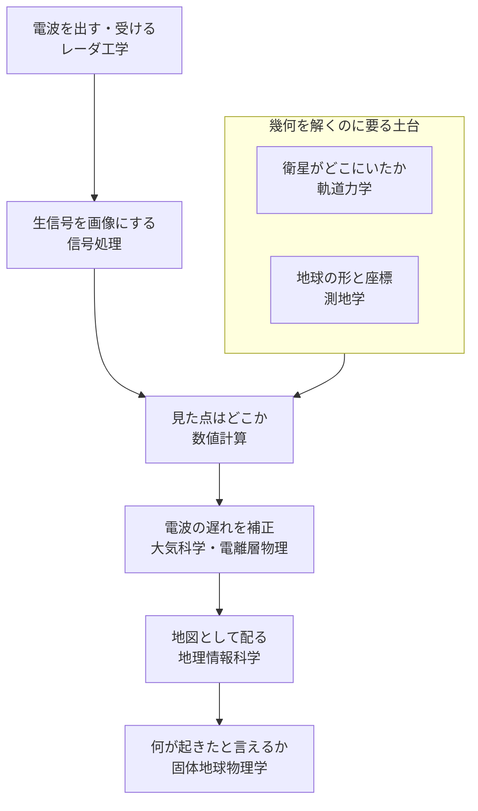

# 08. ISCE3 を支える学問分野

[06-sar.md](06-sar.md) が「用語の意味」なのに対し、ここは
**「これは何の学問なのか / どこを勉強すれば分かるようになるのか」**を置く。

> ⚠️ この章は分野の一般知識に基づく。ISCE3 の実装で裏を取ったものには
> 「確認済み」と書く。書名や年号は**未検証**。

## 全体像: ひとつの分野ではない

ISCE3 は「SAR 処理ライブラリ」と一言で言えるが、中で使われている学問は複数ある。
**電波を出して受け取り、衛星の位置を知り、地球の形を仮定して、
数値的に方程式を解く。** 各段が別の分野に対応する。

| 段階 | 何をするか | 分野 |
|---|---|---|
| 電波を出す・受ける | アンテナ、偏波、帯域 | レーダ工学 / マイクロ波工学 |
| 生信号を画像にする | 合成開口処理、FFT、圧縮 | 信号処理 |
| 衛星がどこにいたか | 状態ベクトル、補間 | 軌道力学 |
| 地球の形と座標 | 楕円体、投影法、基準系 | 測地学 |
| 見た点はどこか | 非線形方程式の反復解法 | 数値計算 |
| 電波の遅れを補正 | 対流圏・電離層・潮汐 | 大気科学 / 電離層物理 / 地球物理学 |
| 何が起きたと言えるか | 地殻変動、氷河、沈下 | 固体地球物理学 / 地形学 |
| 地図として配る | ラスタ、EPSG、GDAL | 地理情報科学 (GIS) |

上位の分野を全部やる必要はない。**ISCE3 に手を入れるだけなら
「幾何と数値計算」「信号処理」のどちらかに寄せて入るのが現実的。**

## 中心にある 3 つ

### リモートセンシング (remote sensing)

**触れずに遠くから対象を測る**技術の総称。
衛星・航空機からの地球観測がその代表で、SAR はその一手法。

「観測量（電波の往復時間と位相）から、知りたい量（地面の変位や高さ）を
どう取り出すか」という**逆問題**の構図がこの分野の本質。
ISCE3 のコードもほぼ全体がこの構図に沿っている。

### 測地学 (geodesy)

**地球の形・大きさ・重力場を測る学問。** SAR 処理の座標系はすべてここから来る。

| 概念 | ISCE3 での現れ方 |
|---|---|
| 参照楕円体 | `core.Ellipsoid` / `WGS84_ELLIPSOID`（確認済み） |
| 地心直交座標 | ECEF。`lon_lat_to_xyz` の出力（確認済み） |
| 測地座標 | LLH。**経度・緯度・高度の順でラジアン**（確認済み） |
| 楕円体高とジオイド高 | DEM の高さがどちらを基準にしているかの区別 |
| 基準座標系 (ITRF など) | 軌道データがどのフレームで与えられるか |

**「緯度」に何種類もある**のが測地学の入口で躓く点。
地心緯度と測地緯度は別物で、`xyz_to_lon_lat` が返すのは測地緯度。
楕円体上では「真下」が地球中心を向かないため、この区別が要る。

### 信号処理 (signal processing)

**合成開口そのもの。** 飛びながら集めた信号を束ねて、
巨大なアンテナがあったかのように解像度を上げる（→ [06](06-sar.md)）。

レンジ方向とアジマス方向でそれぞれ圧縮（マッチドフィルタ）をかけるのが基本形。
FFT が大量に走るため、ISCE3 が C++ / CUDA で書かれ、
`environment.yml` に FFT ライブラリが入っている理由になっている。

`isce3.signal` / `isce3.focus` がこの領域。

## 周辺の分野

### 軌道力学 (orbital mechanics / astrodynamics)

衛星がいつどこにいたかが分からないと、幾何は一切解けない。

ISCE3 が扱うのは**軌道を予測する側ではなく、与えられた状態ベクトルを補間する側**
（確認済み: `core.Orbit` は状態ベクトル列を受け取り Hermite 補間する）。
軌道決定そのものは別のソフトが行い、その成果を受け取る形。

SAR 衛星は**太陽同期軌道**（傾斜角 98° 前後の逆行軌道）に乗ることが多い。
同じ地方時に同じ場所を通るので、観測条件を揃えやすい。

### 数値計算 (numerical methods)

rdr2geo / geo2rdr は**解析的に解けないので反復で解く**（確認済み）。
だから許容誤差と最大反復回数を引数に取る。

ここは分野というより道具で、必要なのは
「Newton 法」「収束判定」「浮動小数点誤差」あたりの基礎知識。
未解決の `GeoToRdr` 失敗（最適化ビルドでのみ落ちる）も、
**浮動小数点の扱いと未定義動作**というこの領域の問題として現れている。

### 固体地球物理学 (solid earth geophysics)

**InSAR で何を測るのか**という出口側。地震・火山・地盤沈下・地滑り・氷河。

「数 cm の位相差が観測された」だけでは意味がなく、
それを断層モデルやマグマ溜まりの膨張として解釈するのがこの分野。
ISCE3 はその手前（解釈可能な干渉画像を作るところ）までを担う。

### 大気科学 / 電離層物理

電波は真空中を飛ぶわけではないので、大気で遅れる。
cm を測る InSAR ではこの遅れが誤差になる。

**「地面が動いた」と「大気のせいでそう見えた」を区別する**のが課題で、
ISCE3 の `atmosphere` / `splitspectrum` / `solid_earth_tides` が対応する（→ [06](06-sar.md)）。

### 地理情報科学 (GIS)

成果物を地図として配る段。投影法、EPSG コード、ラスタ形式。
GDAL への依存はここから来ている。

## 今日の試運転が、どの分野に触れていたか

2026-08-27 に動かした 5 段階を分野に対応させると以下になる（→ [ログ](../logs/2026-08-27-first-run.md)）。

| 動かしたもの | 対応する分野 |
|---|---|
| WGS84 の LLH ⇄ ECEF 往復 | 測地学 |
| 状態ベクトルから軌道を作り補間 | 軌道力学 |
| rdr2geo（方位時刻・斜距離 → 地表） | 測地学 × 数値計算 |
| geo2rdr（逆変換）と往復誤差の確認 | 数値計算 |
| 斜距離を振って入射角と地上間隔を見る | リモートセンシング（観測幾何） |

**信号処理にはまだ一度も触れていない。**
`focus` / `signal` を触ると、そちら側の分野に入ることになる。

## どこから勉強するか

> 以下は分野で定番とされる文献。**未検証**で、内容も確認していない。

| 段 | 文献 | 何が書いてあるか |
|---|---|---|
| SAR の原理 | Curlander & McDonough, *Synthetic Aperture Radar: Systems and Signal Processing* | システムと信号処理の古典 |
| SAR の処理 | Cumming & Wong, *Digital Processing of Synthetic Aperture Radar Data* | アルゴリズムの実装寄り。合成開口処理の定番 |
| InSAR | Hanssen, *Radar Interferometry: Data Interpretation and Error Analysis* | 干渉処理と誤差論 |
| 概説 | Rosen et al., "Synthetic Aperture Radar Interferometry" (Proc. IEEE) | 論文 1 本で全体像を掴む用 |

ISCE3 に手を入れる目的なら、**まず観測幾何**（レンジ・アジマス・入射角・
レーダ座標と地図座標の関係）を押さえるのが近道。
今日の試運転で触ったのはちょうどこの層で、
上位の合成開口処理も下位の補正も、この座標の上に乗っている。
