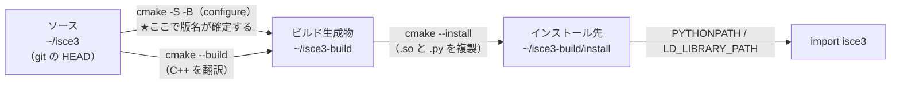

# 環境スナップショット

最終更新: 2026-09-10

| | |
|---|---|
| ソースの HEAD（`~/isce3`） | `67bccb0ce` |
| インストール済みの版 | `0.26.0-dev+23f99329d` |

⚠️ **この 2 つがずれているのは異常ではない。** 意味は「インストール済みのビルドとは何か」を参照。

状況が変わったらこのファイルを上書き更新する。

## マシン構成

| 項目 | 値 |
|---|---|
| OS | WSL2 (Ubuntu 24.04, kernel 5.15 microsoft-standard-WSL2) |
| CPU | 8 コア |
| メモリ | 15 GB |
| GPU | GeForce GTX 1060 6GB / Compute Capability 6.1 / driver 581.57 |
| システム nvcc | `/usr/bin/nvcc` → CUDA 12.0 (V12.0.140) |
| システム gcc | 13.3.0 |
| conda | Miniforge / conda 26.5.3 / `~/miniforge3` |
| チャネル | `conda-forge` のみ |

※ ドライバ番号などは参考値。

## パスの配置

```
~/miniforge3/              conda 本体（全プロジェクト共通）
  └── envs/isce3/          ISCE3 の実行環境
~/isce3/                   upstream の fork をクローンしたもの（ソース）
~/isce3-build/             ビルド生成物。リポジトリの外に置く
  └── install/             実際に import されるもの（.so と .py の複製）
~/isce3-notes/             このメモ
~/nisar-data/              NISAR の実データ。どちらのリポジトリにも入れない
```

## 実際に解決された依存バージョン

`conda env create -f environment.yml` の結果（Eigen のみ手動で降格）。

| パッケージ | 入った版 | `environment.yml` の指定 | 備考 |
|---|---|---|---|
| python | 3.12.13 | `python>=3.8` | |
| **eigen** | **3.4.0** | `eigen>=3.3` | **手動で `eigen<4` に降格。** 既定では 5.0.1 が入りビルド失敗 |
| **hdf5** | **2.2.0** | `hdf5>=1.10.2,!=1.14.0` | ⚠️ メジャー 2 系。上限指定がないため。潜在リスク |
| **gdal** | **3.13.3** | `gdal>=3.6` | ⚠️ `MEM:::DATAPOINTER=` 構文が既定で無効化された。`GDAL_MEM_ENABLE_OPEN=YES` が必要 |
| **pybind11** | **2.13.6** | `pybind11>=2.5` | **手動で `pybind11<3` に降格。** 既定では 3.1.0 が入り、Eigen 派生型の変換が効かずテストが落ちる |
| fftw | 3.3.11 (nompi) | `fftw>=3.3` | |
| numpy | 1.26.4 | `numpy>=1.20` | |
| scipy | 1.17.1 | `scipy!=1.10.0` | |
| shapely | 2.1.2 | `shapely>=2` | |
| pyre | 1.12.6 | `pyre>=1.12.5` | |
| snaphu | 0.4.1 | `snaphu>=0.4` | 位相アンラップ |
| gcc (conda) | 15.3.0 | `cxx-compiler`（無指定） | ⚠️ 非常に新しい |
| cmake | 4.4.2 | `cmake>=3.18` | ⚠️ CMake 4 系 |
| scikit-build-core | 1.0.3 | （ビルド時に pip が取得） | |

### バージョン指定に上限がない問題

`environment.yml` は**ほぼ全て下限のみの指定**で、上限がない。
そのため conda は常に最新を入れようとし、メジャーバージョンが上がった依存で壊れる。

**これまでに 4 つの依存で実際に顕在化している。**

| 依存 | 入った版 | 症状 |
|---|---|---|
| eigen | 5.0.1 | ビルドが通らない → **`eigen<4` に降格して解決** |
| gdal | 3.13.3 | テスト 3 件失敗 → **`GDAL_MEM_ENABLE_OPEN=YES` で解決** |
| pybind11 | 3.1.0 | テスト 1 件失敗 → **`pybind11<3` に降格して解決**（検証済み） |
| cxx-compiler (gcc) | 15.3.0 | `GeoToRdr` が失敗。**最適化起因と確定、未解決**（`-O0` で通り `-O2` で落ちる。FMA は無関係で、UB の疑い） |

詳細は [2026-08-23 ctest 失敗の切り分け](../logs/2026-08-23-test-failures.md) を参照。

`hdf5` も同じ構造（2.2.0 が入っている）なので、いずれ出る可能性がある。
**ビルドや実行が壊れたときは、まず依存のメジャーバージョンを疑う。**

なお、プロジェクトはこれとは別に**バージョンを完全固定した conda spec file** を
持っている。次に依存起因で詰まったらそちらへの乗り換えを検討する。
→ [runtime-and-packaging.md](runtime-and-packaging.md#-バージョン固定された-conda-spec-file-が存在する)

## `environment.yml` の全依存（参考）

チャネル: `conda-forge` + `nodefaults` / 環境名: `isce3`

**ビルド**: `cmake>=3.18`, `ninja`, `cxx-compiler`
**C++ ライブラリ**: `eigen>=3.3`, `fftw>=3.3`, `gdal>=3.6`, `hdf5>=1.10.2,!=1.14.0`,
`libgdal-hdf5`, `libgdal-netcdf`, `pybind11>=2.5`, `pyre>=1.12.5`, `gtest>=1.10`, `gmock>=1.10`
**Python 基盤**: `python>=3.8`, `numpy>=1.20`, `scipy!=1.10.0`, `h5py>=3`, `shapely>=2`
**SAR 処理**: `pyaps3>=0.3`（大気位相補正）, `raider-base>=0.4.5`（対流圏遅延）,
`pysolid>=0.2`（固体地球潮汐）, `snaphu>=0.4`（位相アンラップ）
**その他**: `ruamel.yaml`, `yamale`（設定検証）, `backoff`, `pytest`

`pip` は明記されていない。無い場合は `conda install -n isce3 pip` を足す。
CUDA 関連は**一切含まれていない**。

## 環境の再現手順

### 依存環境（共通）

```bash
source ~/miniforge3/etc/profile.d/conda.sh
cd ~/isce3
conda env create -f environment.yml
# eigen<4 と pybind11<3 は必須。どちらも既定では新しすぎる版が入って壊れる
conda install -n isce3 'eigen<4' 'pybind11<3' ccache
conda activate isce3
```

### 開発用ビルド（CMake 直叩き / 現在こちらを使用）

ビルドディレクトリを**リポジトリの外**に置くことで `~/isce3` を汚さない。

```bash
cmake -S ~/isce3 -B ~/isce3-build -G Ninja \
  -DISCE3_FETCH_DEPS=OFF \
  -DWITH_CUDA=OFF \
  -DCMAKE_INSTALL_PREFIX=~/isce3-build/install
cmake --build ~/isce3-build -j8
cmake --install ~/isce3-build
GDAL_MEM_ENABLE_OPEN=YES ctest --test-dir ~/isce3-build --output-on-failure
```

**基準値は 236/237**（655 秒）。落ちるのは `stage_dem` の 1 件のみ
（upstream のバグ・環境と無関係）。**2 件以上落ちたら自分の変更を疑う。**
`geometry.geometry` は 2026-08-30 に解決した（upstream が未初期化変数を修正）。

### 開発用の環境変数（conda の activate フック）

**これが無いと、新しいシェルで `import isce3` が通らない。**
`ctest` は CMake がパスを埋め込むので動くが、対話的な Python からは見えない。

`~/.bashrc` ではなく conda 環境の中に置く。`conda activate isce3` したときだけ
有効になり、他の環境に漏れない。リポジトリも汚さない。
不要になれば下記 2 ファイルを消すだけで元に戻る。

**`$CONDA_PREFIX/etc/conda/activate.d/isce3-dev.sh`**

```sh
#!/bin/sh
# ISCE3 開発ビルド用の設定
#   ~/isce3-build に CMake でビルド・インストールしたものを import できるようにする。
#   元の値は _ISCE3_OLD_* に退避し、deactivate.d 側で復元する。

_ISCE3_INSTALL="$HOME/isce3-build/install"

export _ISCE3_OLD_PYTHONPATH="${PYTHONPATH:-}"
export _ISCE3_OLD_LD_LIBRARY_PATH="${LD_LIBRARY_PATH:-}"
export _ISCE3_OLD_GDAL_MEM_ENABLE_OPEN="${GDAL_MEM_ENABLE_OPEN:-}"

if [ -d "$_ISCE3_INSTALL/packages" ]; then
    export PYTHONPATH="${PYTHONPATH:+$PYTHONPATH:}$_ISCE3_INSTALL/packages"
fi

for _isce3_libdir in "$_ISCE3_INSTALL"/lib "$_ISCE3_INSTALL"/lib64; do
    if [ -d "$_isce3_libdir" ]; then
        export LD_LIBRARY_PATH="${LD_LIBRARY_PATH:+$LD_LIBRARY_PATH:}$_isce3_libdir"
    fi
done
unset _isce3_libdir _ISCE3_INSTALL

# GDAL は MEM:::DATAPOINTER= 構文をセキュリティ上の理由で既定無効にした。
# ISCE3 がこの構文を使うため、有効化しないと GDAL 関連テストが 3 件落ちる。
export GDAL_MEM_ENABLE_OPEN=YES
```

**`$CONDA_PREFIX/etc/conda/deactivate.d/isce3-dev.sh`**

deactivate 側も作らないと `PYTHONPATH` が他の conda 環境へ漏れる。

```sh
#!/bin/sh
# activate.d/isce3-dev.sh が退避した値を復元する

if [ -n "${_ISCE3_OLD_PYTHONPATH:-}" ]; then
    export PYTHONPATH="$_ISCE3_OLD_PYTHONPATH"
else
    unset PYTHONPATH
fi

if [ -n "${_ISCE3_OLD_LD_LIBRARY_PATH:-}" ]; then
    export LD_LIBRARY_PATH="$_ISCE3_OLD_LD_LIBRARY_PATH"
else
    unset LD_LIBRARY_PATH
fi

if [ -n "${_ISCE3_OLD_GDAL_MEM_ENABLE_OPEN:-}" ]; then
    export GDAL_MEM_ENABLE_OPEN="$_ISCE3_OLD_GDAL_MEM_ENABLE_OPEN"
else
    unset GDAL_MEM_ENABLE_OPEN
fi

unset _ISCE3_OLD_PYTHONPATH _ISCE3_OLD_LD_LIBRARY_PATH _ISCE3_OLD_GDAL_MEM_ENABLE_OPEN
```

#### 動作確認

```bash
conda activate isce3
python3 -c 'import isce3; print(isce3.__version__, isce3.__file__)'
# → 0.26.0-dev+0d1600d8
#   ~/isce3-build/install/packages/isce3/__init__.py
conda deactivate
echo "${PYTHONPATH:-(未設定)}"   # → (未設定) に戻る
```

### 動作確認のみでよい場合（pip ビルド）

`ctest` は使えないが、リポジトリ内にビルドディレクトリを作らない。

```bash
pip install . -C cmake.define.WITH_CUDA=OFF
python3 -c 'import isce3; print(isce3.__version__)'
```

なお pip 版と CMake 版を同居させると `sys.path` の優先順位で
どちらを見ているか分からなくなるため、CMake 版に移る際は
`pip uninstall isce3` しておく。

---

## インストール済みのビルドとは何か

「**インストール済みのビルドは `23f99329d`**」という言い方は、
**`~/isce3` がコミット `23f99329d` だったときのソースから作られたものが
`~/isce3-build/install` に入っている**、という意味。

`23f99329d` は **git の短縮コミットハッシュ**（`Solve CI failures (#366)`、2026-08-24）。
バージョン番号ではない。

### 3 つの場所と、それぞれを作るコマンド

| 場所 | 中身 | 作るコマンド |
|---|---|---|
| `~/isce3` | ソース（git 管理下） | `git` |
| `~/isce3-build` | 中間生成物・`ctest` の実行場所 | `cmake -S … -B …` / `cmake --build` |
| `~/isce3-build/install` | **実際に `import` されるもの**（`.so` と `.py` の複製） | `cmake --install` |



`import isce3` が読むのは **3 番目だけ**。activate フックが
`PYTHONPATH=~/isce3-build/install/packages` を通しているため
（→「開発用の環境変数」）。**ソースを直接読んでいるわけではない。**

### 版名の読み方

`0.26.0-dev+23f99329d` の内訳（実装は `~/isce3/.cmake/Isce3Version.cmake`）:

| 部分 | 出どころ |
|---|---|
| `0.26.0-dev` | `~/isce3/VERSION.txt` の中身そのまま |
| `+23f99329d` | `git describe --always --dirty` の出力 |

Python からは `isce3.__version__` で読める。実体は C++ 拡張モジュールに焼き込まれている
（`__version__ = extisce3.__version__`）。

⚠️ **落とし穴が 3 つある。**

1. **版名は configure 時に確定する。** `cmake --build` を回しただけでは更新されない
   ことがある。つまり版名が指すのは「**最後に configure したときの HEAD**」であって、
   「最後にビルドしたソース」とは限らない
2. HEAD がちょうどタグを指しているとハッシュは付かない（`0.26.0-dev` だけになる）
3. 作業ツリーが汚れていると `-dirty` が付く（例: `0.26.0-dev+23f99329d-dirty`）

### 現在ずれている理由（2026-09-10 時点）

最後に configure / build したのは **2026-08-30**（当時の HEAD が `23f99329d`）。
その後 upstream に 2 回追従したが、**入ったのは Python のみで C++ は無変更**なので
再ビルドしていない。結果としてインストール済みの Python が **8 ファイル**古い。

```
nisar/antenna/beamformer.py          nisar/products/insar/InSAR_base_writer.py
nisar/antenna/pattern.py             nisar/products/readers/Raw/Raw.py
nisar/mixed_mode/__init__.py         nisar/workflows/focus.py
nisar/mixed_mode/logic.py            nisar/workflows/resample_slc_v2.py
```

**これらを使う作業をしないなら、そのままで問題ない。**

### 古くなっていないか確かめる手順

⚠️ **更新時刻（mtime）は当てにならない。** `cmake --install` はソース側の更新時刻を
保持するので、インストール先のほうが古く見えることがある。**中身で比べる。**

```bash
# 1. インストール済みの版と、その実体の場所
python3 -c 'import isce3; print(isce3.__version__, isce3.__file__)'

# 2. ソースの HEAD
git -C ~/isce3 log --oneline -1

# 3. 中身の差（空なら一致。__pycache__ は無視してよい）
diff -rq ~/isce3-build/install/packages/nisar ~/isce3/python/packages/nisar | grep '^Files'

# 4. 特定のファイルだけ確かめる
md5sum ~/isce3-build/install/packages/nisar/<path>.py ~/isce3/python/packages/nisar/<path>.py
```

### 何を変えたら、何をやり直すか

| 変えたもの | 必要な操作 |
|---|---|
| ソースを読んだだけ | **何も要らない** |
| Python のコード | `cmake --install ~/isce3-build` |
| C++ / CUDA のコード | `cmake --build ~/isce3-build -j8` → `cmake --install ~/isce3-build` |
| CMake オプション・依存・版名も合わせたい | `cmake -S ~/isce3 -B ~/isce3-build …` から configure し直す |

⚠️ フルビルド（15〜40 分）とフルテスト（約 10 分）は**ユーザーが実行する**。
